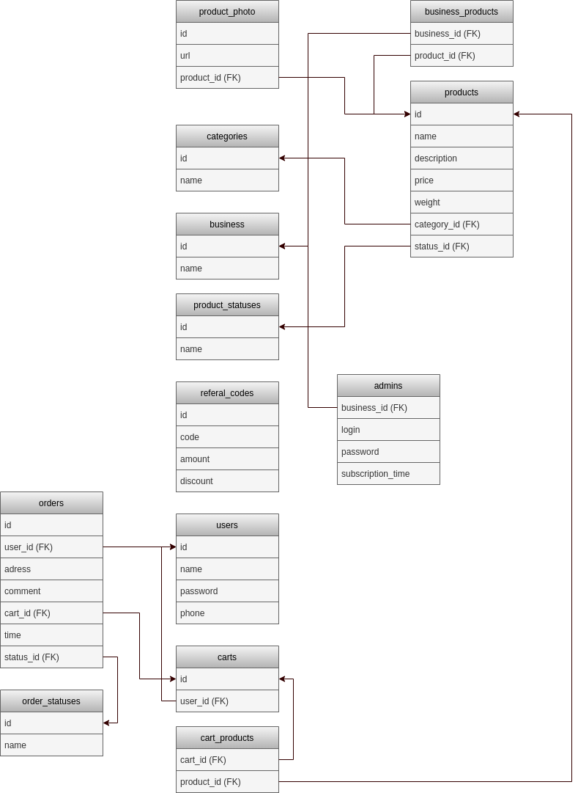

## Business logic

Imagine that there are no food delivery services in a European country. Some people decided
to start their own B2C project in order to then grow to B2B.

If their business becomes B2B, they will be able to connect other cafes and restaurants and offer them a platform with
customers, an admin panel, their own page, orders, a bonus system (_codes_).

**Now we are going to create a B2C with B2B extensibility**. Our delivery app could:

- To get/add/update/delete products.
- To create order.
- Create a notification for telegram after placing an order.

This will be released in the near future:

- Admin panel.
- User/business registration.
- Bonus system.

## Database schema

At the moment it looks like this, in the future
it will be updated, upgraded.




## Poetry initial setup
- Configure Poetry:

```shell
poetry config virtualenvs.in-project false
poetry config virtualenvs.path <conda-install-path>/envs
```

## Packages installation
- Create and activate *conda* virtual environment for development:

```shell
conda create -n venv python=3.10
conda activate venv
```

- Install dependencies with Poetry:

```shell
poetry install
```
## Start project
- Run uvicorn with instance of app:

```shell
uvicorn app.main:app --reload
```

## Run tests
- Run **module** tests.

```shell
pytest -v -k "not integration"
```

- Run **integration** tests.

```shell
pytest -v -k integration
```
